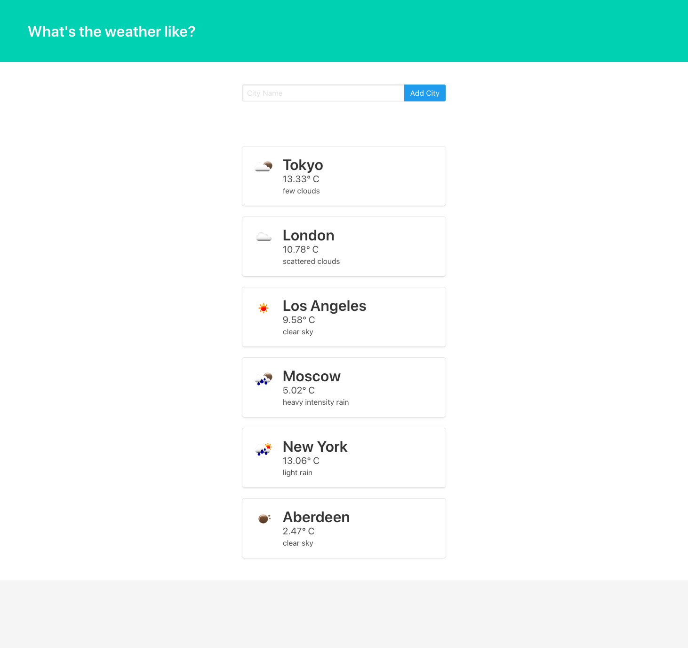

# Weather app in Django using Python Requests

Приложение погоды на Django. Используем Яндекс Погоду АПИ и Openweathermap API.

## Демо


## Сборка

It's best to use the python `pipenv` tool to build locally:

#### `$ pipenv --python python3`
#### `$ pipenv shell`
#### `$ pipenv install django requests autopep8`

## Старт проекта

#### `$ django-admin startproject the_weather`
#### `$ cd the_weather/`
#### `$ python manage.py startapp weather`

Откройте файлы в редакторе и добавьте приложение `weather` в проект в файле `the_weather/settings.py`:

```python
INSTALLED_APPS = [
    'django.contrib.admin',
    'django.contrib.auth',
    'django.contrib.contenttypes',
    'django.contrib.sessions',
    'django.contrib.messages',
    'django.contrib.staticfiles',
    'weather',
]
```
#### `$ python manage.py migrate`
#### `$ python manage.py createsuperuser --username=<your name> --email=<your email address>`

А затем просто запустите приложение:

#### `$ python manage.py runserver`

Откройте [http://localhost:8000](http://localhost:8000) для просмотра в браузере и перейдите в `admin-panel` [http://localhost:8000/admin/](http://localhost:8000/admin/)
<br/>
<br/>
[Домашняя страница](https://localhost:8000/home)
<br/>
[Погода в Брянске](https://localhost:8000/weather/bryansk)

Страница НЕ будет перезагружаться, если вы внесете какие-либо изменения.<br>